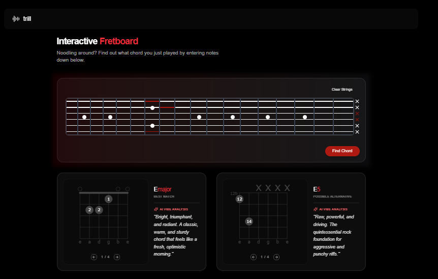
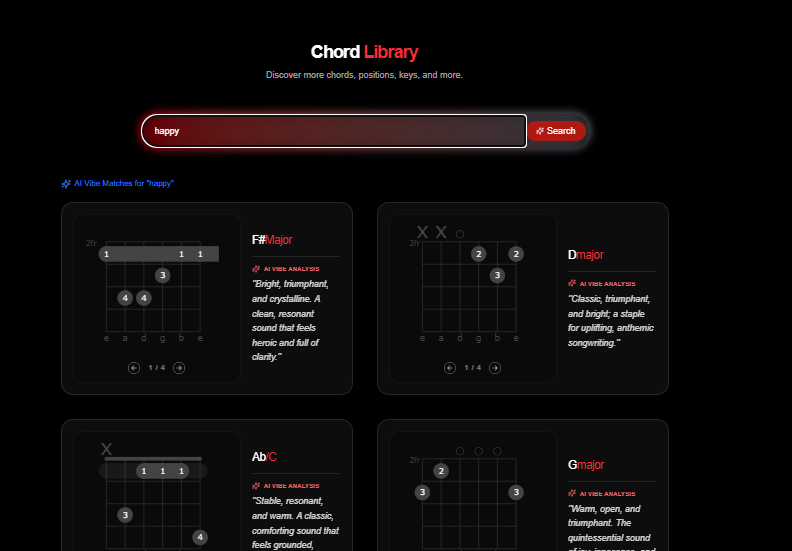

# Trill — Guitar Chord Intelligence

> Play a chord. Describe a feeling. Trill figures out the rest.

Trill is a guitar chord lookup and identification app that combines real-time music theory analysis with AI-powered semantic search. Type a chord name, strum notes on the interactive fretboard, or describe a vibe — Trill finds it.

---

## Screenshots



*Select notes on the fretboard and Trill identifies the chord with voicing analysis and inversion detection.*



*Search by feel. Type "dark jazzy tension" or "bright summer strum" and the AI finds the closest matching chords.*

---

## What Makes This Interesting

### 🎸 Music Theory Engine — Built from Scratch

The chord identification algorithm doesn't use a library. Given raw fret positions from the interactive fretboard, it:

1. Converts fret + string positions to pitch names using guitar tuning math
2. Collapses notes to unique pitch classes (removing octave duplicates)
3. Computes semitone intervals between every pair of notes
4. Scores each candidate against 40+ chord formulas (major, minor, dim7, m7b5, aug9, sus2sus4...)
5. Detects the bass note and resolves **inversions** and **slash chords** (e.g. `G/B`)
6. Normalizes enharmonic equivalents (`C#` ↔ `Db`)

The top 3 matches are returned with a confidence score relative to the best match.

### 🤖 AI Vibe Search

Type a natural language description instead of a chord name. The app:

- Converts your query into a 384-dimensional embedding using `@xenova/transformers` (`all-MiniLM-L6-v2`), running entirely in Node.js with no external API calls
- Queries Firestore's native vector index using `findNearest` with COSINE distance
- Returns the closest semantic matches from pre-embedded chord descriptions

The transformer pipeline is initialized once as a **singleton** — no cold start latency on repeated searches.

### ⚡ Unified Smart Search

A single search bar auto-detects intent:
- `"Cmaj7"` → standard key/suffix lookup against the chord library
- `"something moody and unresolved"` → AI semantic vector search
- The Load More pagination only appears for standard results — AI results are self-contained

---

## Tech Stack

| Layer | Technology |
|---|---|
| Framework | Next.js 16 (App Router) |
| Language | TypeScript |
| Styling | Tailwind CSS |
| Database | Firebase Firestore |
| Vector Search | Firestore native `findNearest` |
| Embeddings | `@xenova/transformers` (all-MiniLM-L6-v2) |
| Client State | TanStack React Query |
| Auth | Firebase Identity Toolkit REST API + Admin SDK session cookies |

---

## Architecture Highlights

- **Server Actions only** — no REST API routes for data fetching. All Firestore queries and auth operations run as typed Server Actions called directly from React Query hooks.
- **Server-side auth** — login and signup use the Firebase Identity Toolkit REST API server-side (the Admin SDK can't verify passwords by design). The response `idToken` is immediately exchanged for a `httpOnly` session cookie via the Admin SDK.
- **Offline chord seeding** — an agentic script generates semantic descriptions for every chord using a language model, then embeds them and writes them to Firestore in bulk. This is a one-time offline operation that powers the entire AI search layer.

---

## Getting Started

### Prerequisites

- Node.js 18+
- A Firebase project with Firestore enabled
- A Firebase service account key

### Installation

```bash
git clone https://github.com/undefinedyara/trill-desktop.git
cd trill-desktop
npm install
```

### Environment Variables

Create a `.env.local` file:

```env
# Firebase Admin (server-side)
FIREBASE_SERVICE_ACCOUNT_BASE64=<your base64-encoded service account JSON>

# Firebase Client (public)
NEXT_PUBLIC_API_KEY=
NEXT_PUBLIC_AUTH_DOMAIN=
NEXT_PUBLIC_PROJECT_ID=
NEXT_PUBLIC_STORAGE_BUCKET=
NEXT_PUBLIC_MESSAGE_SENDER_ID=
NEXT_PUBLIC_APP_ID=
```

To encode your service account:
```bash
# macOS / Linux
cat serviceAccountKey.json | base64

# Windows (PowerShell)
[Convert]::ToBase64String([IO.File]::ReadAllBytes("serviceAccountKey.json"))
```

### Seed the Database

```bash
# Dry run (no writes)
npx tsx scripts/seed/seed.ts -- --path=../chords-db/guitar/chords

# Write to Firestore
npx tsx scripts/seed/seed.ts -- --write --path=../chords-db/guitar/chords
```

Chord data sourced from [chords-db](https://github.com/tombatossals/chords-db). All keys and suffixes are normalized to lowercase before storage.

### Run

```bash
npm run dev
```

Open [http://localhost:3000](http://localhost:3000).

---

## Available Scripts

| Script | Description |
|---|---|
| `npm run dev` | Start development server |
| `npm run build` | Build for production |
| `npm run lint` | Lint the project |
| `npx tsx scripts/seed/seed.ts` | Seed chord database |
| `npx tsx scripts/test-firebase.ts` | Test Firebase connection |
