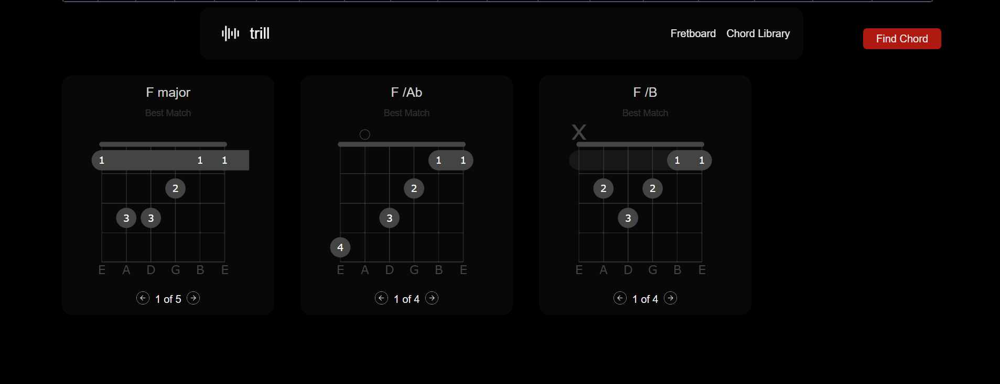
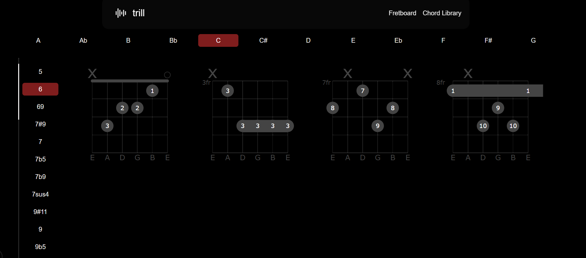

# Trill Desktop

**Note:** I'm excited to announce that we'll be deploying Trill Desktop soon! Stay tuned for a live version.

Trill Desktop is a web application that helps musicians identify chords from notes played on a virtual fretboard. It's a powerful tool for learning and understanding music theory.

## Demo

Here's a sneak peek of Trill Desktop in action:


_Caption: The user selects notes on the fretboard and the app identifies the chord._



_Caption: The app displays different voicings for F major chord. along with other chord matches._



_Caption: An additional feature allows users to browse different chords using the chord library._

## Features

### Chord Finder

The core feature of Trill Desktop is the Chord Finder. It allows you to select notes on a virtual guitar fretboard and identify the chord you are playing.

Here's how it works:

1.  **Select Notes:** Click on the fretboard to select the notes of a chord.
2.  **Find Chord:** Click the "Find Chord" button.
3.  **View Results:** The application will display the most likely chord graphs for the selected notes, along with different ways to play the chord.

### How it Works Under the Hood

The Chord Finder uses a combination of client-side music theory analysis and a backend service to provide fast and accurate results.

1.  **Local Inference (Client-Side):** When you click "Find Chord", the application first analyzes the notes you've selected directly in your browser.

    - It converts the fret and string positions to musical notes.
    - A music theory engine then identifies the most likely chord names by comparing the selected notes to a vast database of chord formulas.

2.  **Data Fetching (Server-Side):**
    - The top 3 best matches are then sent to a server-side API.
    - The API connects to a Firebase Firestore database to retrieve detailed chord information.

#### Firebase Integration

- **Connection:** The application connects to Firebase using a service account configuration encoded to base64 and then decoded on the server.
- **Database Seeding:** The chord library in Firestore is populated using a custom script (`scripts/seed/seed.ts`).

  - The script reads chord data from the invaluable [chords-db](https://github.com/tombatossals/chords-db) project.
  - It extracts all unique chord keys (e.g., C, G, Am) and suffixes (e.g., "major", "minor", "dim7") and stores them in separate collections for efficient lookup.
  - Finally, it iterates through and seeds the main 'chords' collection with detailed information for each chord voicing.

- **Data Transformation:** Before being stored in the database, the raw chord data undergoes a transformation (`scripts/seed/helpers/transform-chords.ts`).
  - Fret positions, which can be represented by numbers, 'x' (muted), or letters (for frets 10+), are normalized into a consistent numerical format. For example, 'x' becomes -1 and letters like 'a' are converted to their corresponding fret number (10).
  - Fingerings are converted into a numerical array.
  - Barre chord information is standardized into an array format.

This structured and cleaned data allows the application to quickly and efficiently query for chords and display their diagrams.

## Tech Stack

- **Framework:** [Next.js](https://nextjs.org/)
- **Language:** [TypeScript](https://www.typescriptlang.org/)
- **Styling:** [Tailwind CSS](https://tailwindcss.com/)
- **Database:** [Firebase Firestore](https://firebase.google.com/docs/firestore)
- **State Management:** [React Query](https://tanstack.com/query/latest)

## Getting Started

To get a local copy up and running, follow these simple steps.

1.  **Clone the repository:**
    ```bash
    git clone https://github.com/undefinedyara/trill-desktop.git
    cd trill-desktop
    ```
2.  **Install dependencies:**
    ```bash
    npm install
    ```
3.  **Set up Environment Variables:**

    - Create a `.env` file in the root of the project.
    - Create a Firebase service account and get your credentials JSON file.
    - Encode the entire content of the JSON file to Base64. You can use an online tool or this command:
      ```bash
      # On macOS or Linux
      cat /path/to/your/serviceAccountKey.json | base64
      ```
    - Add the Base64 string to your `.env` file as `FIREBASE_SERVICE_ACCOUNT_BASE64`.

4.  **Seed the Database:**
    - Run the seed script to populate your Firestore database with chord data. The `--write` flag is required to commit the data. Otherwise a dry-run is performed.
    ```bash
    npm run seed -- --write
    ```
5.  **Run the Development Server:**
    ```bash
    npm run dev
    ```
    - Open [http://localhost:3000](http://localhost:3000) in your browser to see the result.

## Available Scripts

- `npm run dev`: Starts the development server.
- `npm run build`: Builds the application for production.
- `npm run start`: Runs the production-ready build.
- `npm run lint`: Lints the project files for code quality.
- `npx tsx scripts/seed/seed.ts`: Runs the database seeding script.

  - **--write**: (Required) Commits the data to Firestore. Without this, the script will only perform a dry run.
  - **--path=<path-to-chords-db>**: (Optional) Specifies the local path to the `chords-db` repository if it's not in the default location.
  - _Example:_ `npx tsx scripts/seed/seed.ts -- --write --path=../path/to/your/chords-db`

- `npx tsx scripts/test-firebase.ts`: Runs a diagnostic script to test the connection to your Firebase instance.
